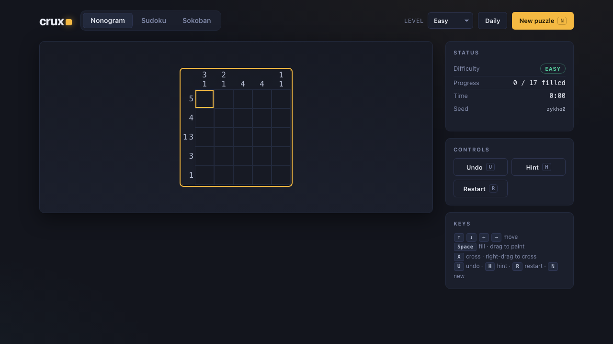
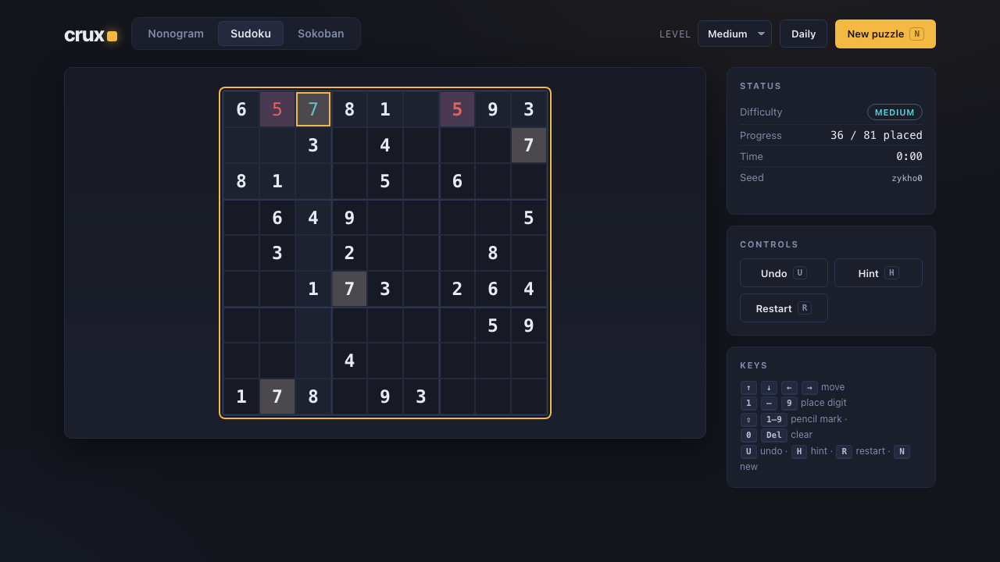
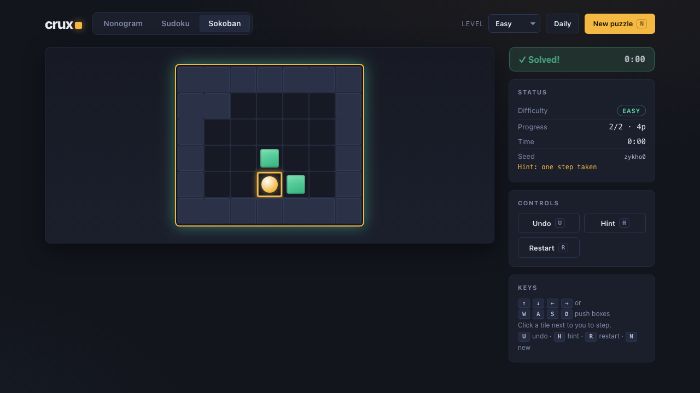

# crux

A client-side logic-puzzle game — **nonogram**, **sudoku**, and **sokoban** — built
in TypeScript (strict) + Vite. Static, no backend, zero runtime dependencies. The
solvers are the heart of the project: each puzzle type ships a *solver*, a
*generator* that uses the solver as an oracle to guarantee solvable (and, where it
applies, uniquely solvable) boards, and an interactive *player UI*.



## The idea: the solver is the oracle

Every generator leans on its solver to guarantee quality:

| Puzzle   | Solver                                                       | Generator guarantee |
|----------|-------------------------------------------------------------|---------------------|
| Nonogram | per-line constraint-propagation DP + backtracking           | **unique** solution |
| Sudoku   | constraint propagation + **DLX** (dancing links) exact cover | **unique** solution |
| Sokoban  | **A\*** over box states + simple-deadlock pruning           | **solvable** by construction |

- **Nonogram** — a complete per-line reachability DP deduces every forced cell;
  whole-grid propagation runs to a fixpoint, then backtracking counts solutions up
  to 2 so uniqueness is decided exactly. A random solution grid is drawn, its clues
  derived, and the board is accepted only if the solver proves it unique.
- **Sudoku** — Knuth's Dancing Links solves the exact-cover formulation and counts
  solutions (capped at 2) to verify uniqueness. Generation builds a random full grid
  then digs cells while DLX confirms a single solution remains, so the dug puzzle's
  unique solution *is* the original grid.
- **Sokoban** — A\* searches `(boxes, normalized-player)` states with an admissible
  sum-of-nearest-goal-push-distance heuristic and prunes simple deadlocks (a
  reverse-pull BFS marks cells from which no box can ever reach a goal). Levels are
  generated by scrambling a solved room with random *reverse* pulls — every pull is
  the exact reverse of a legal push, so solvability is guaranteed without retrying.

Everything is **seeded and deterministic**: a given seed always produces the same
board on any machine (mulberry32 + xmur3). Difficulty is **graded by how much work
the solver needed** (propagation rounds, DLX/A\* search nodes, technique depth), and
the generators resample to honour a requested difficulty.

## Play

```bash
pnpm install
pnpm dev          # http://localhost:5173
```

- **Nonogram** — arrows move · `Space` fill · `X` cross · drag to paint.
- **Sudoku** — arrows move · `1`–`9` place · `Shift`+`1`–`9` pencil · `0`/`Del` clear.
- **Sokoban** — arrows or `W A S D` push · click an adjacent tile to step.
- Global — `U` undo · `H` solver-powered hint · `R` restart · `N` new puzzle.
- **Daily** mode seeds the board from today's date, so everyone gets the same puzzle.

 

## Develop

```bash
pnpm typecheck    # tsc --noEmit (strict)
pnpm test         # Vitest unit + property + difficulty tests
pnpm build        # tsc + vite build (static bundle in dist/)
pnpm screens      # Playwright drives the built app, writes /screens
```

### Tests

Each solver has unit tests against known boards, **property tests** (generate N
boards → the solver confirms each is solvable/unique and matches its solution), and
difficulty-grading sanity checks. The whole suite runs in a couple of seconds.

## Layout

```
src/
  lib/        seeded RNG, daily-seed helpers, shared types
  nonogram/   types · solver · generator (+ tests)
  sudoku/     types · dlx · solver · generator (+ tests)
  sokoban/    types · level · solver · generator (+ tests)
  ui/         dom helpers · app shell · one view per puzzle type
tests/e2e/    Playwright screenshot + interaction checks
screens/      generated screenshots
```

The runtime is pure logic and featherlight — the production bundle is ~14 kB gzipped
with no third-party runtime dependencies.
